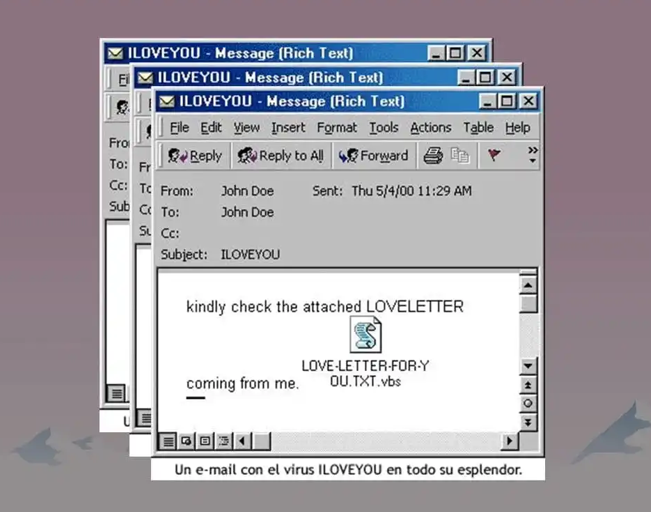

¿Qué pasaría si un día miras tu correo electrónico y encuentras un mensaje diciendo **"Te amo"** y dentro tiene un archivo llamado **"Carta de amor para ti"**?

**I LOVE YOU** fue uno de los virus informáticos mas notorios y destructivos de la historia. Surgió el 4 de mayo del año 2000, propagándose rápidamente a través de correo electrónico causando estragos alrededor de todo el mundo.

El infame virus llegaba camuflado bajo el aparente inofensivo asunto "I Love You" en el cual se encontraba un archivo adjunto llamado "Love Letter For You.txt.vbs". Cuando un usuario curioso abría el archivo adjunto, el virus se activaba, replicándose y enviando copias de si mismo a toda la lista de usuarios del correo electrónico infectado.

Lo más curioso era la ingeniería social detrás del virus. Debido a que el mensaje de amor apelaba a la curiosidad y la emoción humana de la víctima, sin sospechar que detrás se encontraba un programa malicioso.

Ya dentro del sistema el virus se propagaba de manera inmediata, sobrescribiendo archivos y eliminando archivos multimedia así como determinadas extensiones, como documentos de Word y Excel. El alcance y su velocidad tomaron por sorpresa a muchos usuarios y empresas, causando pérdidas económicas significativas y problemas generalizados de seguridad.

## Origen y creación de I Love You

**Onel de Guzman**, estudiante de la universidad de Manila, fue el creador del infame virus. Supuestamente, creó el virus como parte de un proyecto de investigación para su tesis universitaria, la cual termino siendo rechazada por la universidad, lo cual contribuyo en la decisión de lanzar el virus al mundo.

El caso de Onel de Guzman resalta la importancia de la ética en la investigación y el desarrollo de software, así como la necesidad de una mayor conciencia sobre los riesgos de la seguridad cibernética. Aunque su acción fue altamente perjudicial y tuvo consecuencias significativas, también sirvió como un recordatorio de los peligros que pueden surgir cuando la tecnología se usa de manera irresponsable y maliciosa.

El impacto del virus I Love You fue monumental, tanto en perdidas económicas como conciencia publica sobre la seguridad en la red. Este incidente sirvió como una llamada de atención para mejorar las medidas de seguridad y la conciencia sobre las amenazas en el internet.

Ya han pasado mas de dos décadas desde el brote inicial del virus, pero su legado continua como un recordatorio de los peligros que pueden surgir de la interacción descuidada con los e-mails y los archivos adjuntos desconocidos.