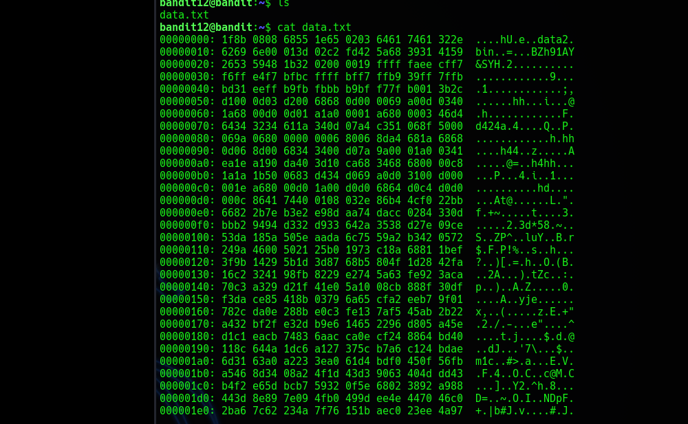

```
      ,----..            ,----,          .---.
     /   /   \         ,/   .`|         /. ./|
    /   .     :      ,`   .'  :     .--'.  ' ;
   .   /   ;.  \   ;    ;     /    /__./ \ : |
  .   ;   /  ` ; .'___,/    ,' .--'.  '   \' .
  ;   |  ; \ ; | |    :     | /___/ \ |    ' '
  |   :  | ; | ' ;    |.';  ; ;   \  \;      :
  .   |  ' ' ' : `----'  |  |  \   ;  `      |
  '   ;  \; /  |     '   :  ;   .   \    .\  ;
   \   \  ',  /      |   |  '    \   \   ' \ |
    ;   :    /       '   :  |     :   '  |--"
     \   \ .'        ;   |.'       \   \ ;
  www. `---` ver     '---' he       '---" ire.org
```

Bandit es un juego de desafíos de seguridad que forma parte de la plataforma OverTheWire. Está diseñado para enseñar conceptos básicos de seguridad y administración de sistemas a través de ejercicios prácticos. Bandit se enfoca en la manipulación de archivos, permisos, comandos de Linux y algunos aspectos de la programación en bash.

Los desafíos están organizados en niveles, donde cada nivel requiere resolver una tarea para obtener una contraseña (flag), que luego se utiliza para acceder al siguiente nivel. Es una excelente forma de aprender o practicar habilidades de terminal y seguridad informática en un entorno controlado.

En el siguiente artículo, encontrarás una serie de writeups que documentan la resolución de los ejercicios.

A lo largo de este recorrido, se explican las soluciones a cada uno de los niveles, proporcionando detalles sobre las herramientas y estrategias utilizadas para obtener las contraseñas que permiten avanzar al siguiente desafío.

```
             _                     _ _ _
            | |__   __ _ _ __   __| (_) |_
            | '_ \ / _` | '_ \ / _` | | __|
            | |_) | (_| | | | | (_| | | |_
            |_.__/ \__,_|_| |_|\__,_|_|\__|

           This is an OverTheWire game server.
   More information on http://www.overthewire.org/wargames
```

:::TIP
- Para comenzar con los ejercicios de Bandit, es necesario que ingreses utilizando `SSH`.
- El host al que debes conectarte es `bandit.labs.overthewire.org` en el puerto `2220`
- Username: bandit0, Password: bandit0
- `$ ssh bandit0@bandit.labs.overthewire.org -p 2220`
:::

#### Happy Hacking! 

_______________


## Bandit 0
*"The flag is stored in a file called readme located in the home directory."*
```
ls -> README -> cat README
NH2SXQwcBdpmTEzi3bvBHMM9H66vVXjL
```
_______________

## Bandit 1
*"The flag is stored in a file called - located in the home directory"*
```
ls -> - -> cat ./-
rRGizSaX8Mk1RTb1CNQoXTcYZWU6lgzi
```
_______________

## Bandit 2
*"The flag is stored in a file called spaces in this filename located in the home directory"*
```
ls -> spaces in this filename -> cat "spaces in this filename"
aBZ0W5EmUfAf7kHTQeOwd8bauFJ2lAiG
```
_______________

## Bandit 3
*"The flag is stored in a hidden file in the inhere directory"*
```
ls -> inhere -> cd inhere -> (hidden files) -> ls -a -> .  ..  .hidden -> cat .hidden
2EW7BBsr6aMMoJ2HjW067dm8EgX26xNe		
```
_______________

## Bandit 4
*"The flag is stored in the only human-readable file in the inhere directory"*
```
ls -> inhere -> cd inhere -> -file00 -file01 -file02 -file03 -file04 -file05 -file06 -file07 -file08 -file09 -> cd (salimos de la carpeta inhere)
   -> file inhere/* (muestrame todos los tipos de archivos de la carpeta "inhere") -> inhere/-file00: OpenPGP Public Key
								        		    
                        inhere/-file01: data
						inhere/-file05: data
						inhere/-file06: data
						inhere/-file07: ASCII text
                        inhere/-file08: data

-> cd inhere -> cat ./-file07  ->  lrIWWI6bB37kxfiCQZqUdOIYfr6eEeqR
```
_______________

## Bandit 5
*"The flag is stored in a file somewhere under the inhere directory and has all of the following properties:"*
1. *Human-readable*	
2. *1033 bytes in size*	
3. *Not executable*
```
ls -> inhere -> find . -type f -readable -size 1033c ! -executable -> ./inhere/maybehere07/.file2 -> cat ./inhere/maybehere07/.file2 | xargs
P4L4vucdmLnm8I7Vl7jG1ApGSfjYKqJU 
```
_______________

## Bandit 6
*"The flag is stored somewhere on the server and has all of the following properties:"*
1. *Owned by user bandit7*	
2. *Owned by group bandit6*	
3. *33 bytes in size*
(Cuando entras y usas ls no hay nada, asi que se debe buscar desde la raíz, ósea con `/`)
```
ls -> (empty) -> find / -user bandit7 -group bandit6 -size 33c 
```
En este momento sale una cantidad exagerada de archivos pero con `Permission denied`, 
por lo tanto tenemos que usar `2>/dev/null`, el cual nos permite redireccionar todos los errores a `null` el cual funciona como agujero negro
Quedaría de esta forma:
```
-> find / -user bandit7 -group bandit6 -size 33c 2>/dev/null -> /var/lib/dpkg/info/bandit7.password
```	
Para ver la flag podemos usar 2 formas
```
find / -user bandit7 -group bandit6 -size 33c 2>/dev/null | xargs cat
z7WtoNQU2XfjmMtWA8u5rN4vzqu4v99S
```
ó
```
cat /var/lib/dpkg/info/bandit7.password
z7WtoNQU2XfjmMtWA8u5rN4vzqu4v99S  
```
_______________

## Bandit 7
*"The flag is stored in the file data.txt next to the word millionth"*
```
ls -> data.txt -> cat data.txt | wc -l -> (wc -l significa words count -l lines) 98567 -> grep "millionth" data.txt
-> millionth	TESKZC0XvTetK0S9xNwm25STk5iWrBvP
```
Ahora bien, puedes jugar con las búsquedas, como: 
```
grep "^m" 
```
Buscará todas las lineas que partan con **m**, para buscar algo en lo que termine se usa `$` 
```
grep "^hola$" data.txt 
```
Busca todas las palabras que inicien con **H** y terminen con **a**

```
grep "millionth" data.txt -n (muestra en que linea se ubica) -> 3521:millionth TESKZC0XvTetK0S9xNwm25STk5iWrBvP
```
```
awk 'NR==3521' data.txt (muestra que hay en esa linea) -> millionth	TESKZC0XvTetK0S9xNwm25STk5iWrBvP  
```
Igualmente, `millionth	TESKZC0XvTetK0S9xNwm25STk5iWrBvP`, no está del todo correcto al verlo con: `$ cat data.txt | grep "millionth"`, debido a que te muestra la linea completa y en realidad nosotros queremos ver solo el segundo argumento, el cual es la flag.
Para esto podemos usar: `awk`
```
$ cat data.txt | grep "millionth" | awk '{print $2}'
```

_______________

## Bandit 8
*"The flag is stored in the file data.txt and is the only line of text that occurs only once"*

Si utilizas `sort` el contenido del archivo se ordena alfabéticamente
Con `uniq -u` puedes listar lineas únicas
```
ls -> data.txt -> cat data.txt | sort | uniq -u
EN632PlfYiZbn3PhVK3XOGSlNInNE00t
```
También puedes hacerlo con:
```
$ sort data.txt | uniq -u
EN632PlfYiZbn3PhVK3XOGSlNInNE00t
```
_______________

## Bandit 9
*"The password for the next level is stored in the file data.txt in one of the few human-readable strings, preceded by several ‘=’ characters"*

Cuando un archivo no es legible puedes utilizar el comando `strings` que es para listar las cadenas de caracteres imprimibles de un archivo 
```
ls -> data.txt -> strings data.txt | grep "===="
========== the#
========== password
========== is
========== G7w8LIi6J3kTb8A7j9LgrywtEUlyyp6s

G7w8LIi6J3kTb8A7j9LgrywtEUlyyp6s
```
_______________

## Bandit 10
*"The password for the next level is stored in the file data.txt, which contains base64 encoded data"*

`base64` : Es un sistema de numeración posicional que usa 64 como base. Es la mayor potencia que puede ser representada usando únicamente los caracteres imprimibles de ASCII. Esto ha propiciado su uso para codificación de correos electrónicos, PGP y otras aplicaciones. 
:::TIP
Puedes ver el manual de base64 utilizando el comando: `$ man base64`, aqui indica que puedes decodificar un archivo usando el paramentro `-d`
:::
```
ls -> data.txt -> cat data.txt -> VGhlIHBhc3N3b3JkIGlzIDZ6UGV6aUxkUjJSS05kTllGTmI2blZDS3pwaGxYSEJNCg==
```
El contenido del archivo esta codificado
```
$ base64 -d data.txt -> The password is 6zPeziLdR2RKNdNYFNb6nVCKzphlXHBM
6zPeziLdR2RKNdNYFNb6nVCKzphlXHBM
```
"Como información extra, puedes crear una cadena en `base64` de la siguiente manera:"
```
$ echo "Hola esto es una prueba" | base64 -> SG9sYSBlc3RvIGVzIHVuYSBwcnVlYmEK
$ echo "SG9sYSBlc3RvIGVzIHVuYSBwcnVlYmEK" | base64 -d -> Hola esto es una prueba
```
_______________

## Bandit 11
*"The password for the next level is stored in the file data.txt, where all lowercase (a-z) and uppercase (A-Z) letters have been rotated by 13 positions"*

`"ROT13"` : Es un sencillo cifrado César utilizado para ocultar un texto sustituyendo cada letra por la letra que está trece posiciones por delante en el alfabeto. A se convierte en N, B se convierte en O y así hasta la M, que se convierte en Z. Luego la secuencia se invierte: N se convierte en A, O se convierte en B y así hasta la Z, que se convierte en M.


```
ls --> data.txt --> cat data.txt
Gur cnffjbeq vf WIAOOSFzMjXXBC0KoSKBbJ8puQm5lIEi
```
Ahora podrías tomar el string y desencriptarlo en:

https://rot13.com/

```
The password is JVNBBFSmZwKKOP0XbFXOoW8chDz5yVRv
```
*pssst... puede que invente una herramienta de cifrado, de ser así la puedes encontrar en mi github*

_______________

## Bandit 12
*The password for the next level is stored in the file data.txt, which is a hexdump of a file that has been repeatedly compressed. For this level it may be useful to create a directory under /tmp in which you can work using mkdir. For example: mkdir /tmp/myname123. Then copy the datafile using cp, and rename it using mv (read the manpages!)*

Leemos el archivo data.txt, copiamos su interior y lo pegamos en un archivo nvim que creamos en nuestro escritorio de usuario
```    
cat data.txt
cd Desktop --> mkdir data --> cd data --> nvim data
```
`"Sistema hexadecimal"` : El sistema hexadecimal es el sistema de numeración posicional que tiene como base el 16, el orden hexadecimal es 0123456789ABCDEF




:::NOTE
- `sponge` se instala con el paquete `moreutils`
- `xxd` se instala directo
- Ambos no vienen pre instalados en Kali Linux
:::

Creamos un txt en el escritorio y copiamos el `hexdump`
Podemos utilizar `xxd` para transformar archivos a hexadecimal

PD: Si queremos agregar texto a un txt utilizamos por ejemplo:
```
cat test | awk {print $3} > test
```
Estaremos sobrescribiendo el archivo

Y si utilizamos: 
```
cat test | awk {print $3} >> test 
```
Estamos utilizando un append agregando cosas al final del archivo.

Lo que nosotros necesitamos esta vez es utilizar `sponge`
```
cat test | awk {print $3} | sponge test
> es
```

`Sponge` nos permite extraer datos como por ejemplo los hexadecimales para colocarlos en un archivo.
Buscamos revertir el hexadecimal para luego "spongearlo" a un txt

Copiamos el texto de `data` y creamos un nuevo archivo data en el escritorio con el texto dentro.
Luego hacemos `xxd -r` para revertir el hexadecimal y luego usar `sponge` para capturarlo y guardarlo nuevamente en el mismo archivo data
```
cat data | xxd -r | sponge data
```
Si utilizamos `cat data` nos da este resultado:
```
kali@kali:~/Desktop$ cat data                   
�h44�z��A����@=�h4hh�▒▒��4�i��1����▒��hd����9���1����������;,�
�����2�3d*58�~  �S�▒ZP^��luY��Br$�FP!%�s��h�?�)=�h��O(B��2A���)�tZc��:�pã)�A�ˈ�0���΅A�yjeϢx,�(����z�E�+"�2�/�-��e"���^����t�j���$�d�@�dJơ'7\���$��m1c��#>�aԽ�EV��F��OCӐc@M�C�����Y2^h8���D=��~ O�I��NDpF�+�|b#Jv�#�J��d�LފW$�Û�▒y�`
                        �\& ���@*w�M�0�nr��C��`e$b�
      ~����
            ��`�<����a��?e:T���e�T4±b����)�@���x=
```

Ahora podemos utilizar la herramienta `7z`

Primero hacemos:
```
kali@kali: ~/Desktop$ mv data data.gz
```
Para tenerlo como archivo comprimido, luego utilizamos `7z` para ver su contenido y luego descomprimirlo
```
kali@kali: ~/Desktop$ 7z l data.gz 

7-Zip 23.01 (x64) : Copyright (c) 1999-2023 Igor Pavlov : 2023-06-20
 64-bit locale=C.UTF-8 Threads:2 OPEN_MAX:1024

Scanning the drive for archives:
1 file, 606 bytes (1 KiB)

Listing archive: data.gz
--
Path = data.gz
Type = gzip
Headers Size = 20

   Date      Time    Attr      Size   Compressed  Name
------------------- ----- --------- ------------  -------------
2023-10-05 02:19:20 .....       573          606  data2.bin
------------------- ----- --------- ------------  -------------
2023-10-05 02:19:20             573          606  1 files
```

Dentro encontramos un archivo `data2.bin`

Con `7z x data.gz` podemos extraer cualquier archivo comprimido sin importar su tipo

Utilizamos 
```
$ 7z x data.gz 
```
Y nos da un archivo `data2.bin`
:::NOTE
El el archivo fue comprimido multiples veces por lo que tendremos que repetir la operacion
:::

Después de múltiples
`7z l data`
`7z x data`

Damos con el siguiente resultado:

```
kali@kali:~/Desktop$ ls
BroadcomInstaller2021  data2      data5.bin  data8.bin  
Flags                  data2.bin  data6      data9.bin  
data.gz                data4.bin  data6.bin  

kali@kali:~/Desktop$ cat data9.bin 
The password is wbWdlBxEir4CaE8LaPhauuOo6pwRmrDw
```
_______________

## Bandit 13
*"The password for the next level is stored in /etc/bandit_pass/bandit14 and can only be read by user bandit14. For this level, you don’t get the next password, but you get a private SSH key that can be used to log into the next level."* 
- *"Note: localhost is a hostname that refers to the machine you are working on"*

```
bandit13@bandit:~$ ls
sshkey.private

bandit13@bandit:~$ cat sshkey.private
// This is a sample key for illustrative purposes only
--FAKE BEGIN EXAMPLE KEY--
gg0t7Fwas8NLGa5+Uzec2rEg0WmeevB13AIoYp0MZyETq46t+jk9puNwZwIt9
jiTF0dsis8uzMlYQ4l1Lzh/8/MpvhCQF8r22dwIDAQABAoIBAQC6dWBjhyEOz
J3ssRW9     ESTA ES UNA PRIVATE KEY DE EJEMPLO     fygoQSw3RX
pvJt3SmU8hIDuY5p7B     NO ES REAL     hju8sg8/3FyjyNAq22x/fzl
xAh0wqO/u8FB5I3LAI2Vp6OviwvdWeC4nOxCthldpuPKN1LA8rmMMVRTKQ+7T
laL3ZGdaLxCIwtCnEucB9DvN2HZkupc/h6hTKUYLqXuyLD18njTrbRhLgbC9Q
--FAKE END EXAMPLE KEY--

bandit13@bandit:~$ ssh -i sshkey.private bandit14@localhost -p2220
  Enjoy your stay!

bandit14@bandit:~$ 
```
:::NOTE
OJO: The password for the next level is stored in /etc/bandit_pass/bandit14
:::
```
bandit14@bandit:~$ cat /etc/bandit_pass/bandit14
fGrHPx402xGC7U7rXKDaxiWFTOiF0ENq
```
_______________

## Bandit 14
*"The password for the next level can be retrieved by submitting the password of the current level to port 30000 on localhost."*
1. Comandos útiles:
      - `ssh`, `telnet`, `nc`, `openssl`, `s_client`, `nmap`

#### ¿Que es netcat?
`netcat` es una herramienta de red que, a través de un intérprete de comandos y con una sintaxis sencilla, permite abrir puertos TCP/UDP en un host, asociar una shell a un puerto en específico y forzar conexiones UDP/TCP.

```
bandit14@bandit:~$ nc localhost 30000
(Aqui esta vacío y hay que ingresar la contraseña de bandit13)
fGrHPx402xGC7U7rXKDaxiWFTOiF0ENq
Correct!
jN2kgmIXJ6fShzhT2avhotn4Zcka6tnt
```
Y ahora tenemos la contraseña que podemos utilizar para bandit15
_______________

## Bandit 15
*"The password for the next level can be retrieved by submitting the password of the current level to port 30001 on localhost using SSL encryption."*
*"Helpful note: Getting “HEARTBEATING” and “Read R BLOCK”? Use -ign_eof and read the “CONNECTED COMMANDS” section in the manpage. Next to ‘R’ and ‘Q’, the ‘B’ command also works in this version of that command…"*

1. Comandos útiles:
   - `ssh`, `telnet`, `nc`, `openssl`, `s_client`, `nmap`

:::NOTE
Localhost = 127.0.0.1
:::
```
bandit15@bandit:~$ ncat --ssl 127.0.0.1 30001
jN2kgmIXJ6fShzhT2avhotn4Zcka6tnt
Correct!
JQttfApK4SeyHwDlI9SXGR50qclOAil1
```