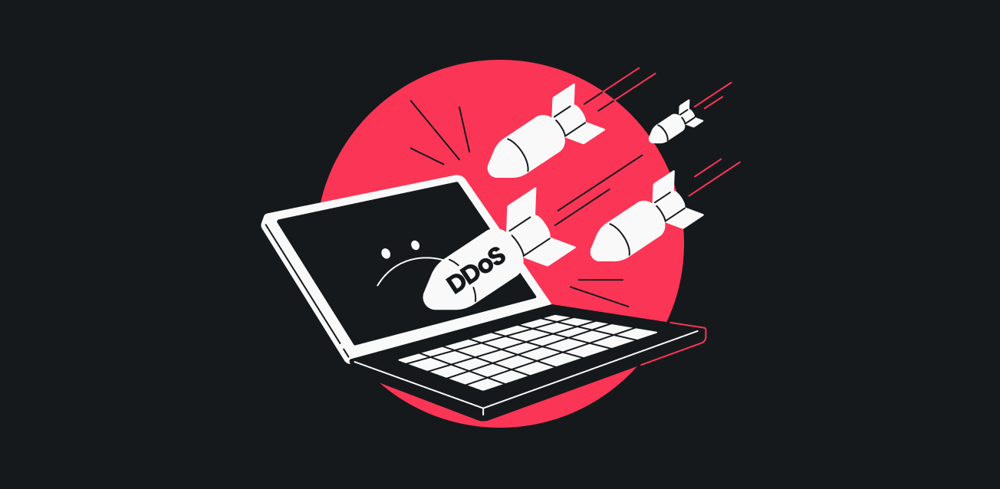
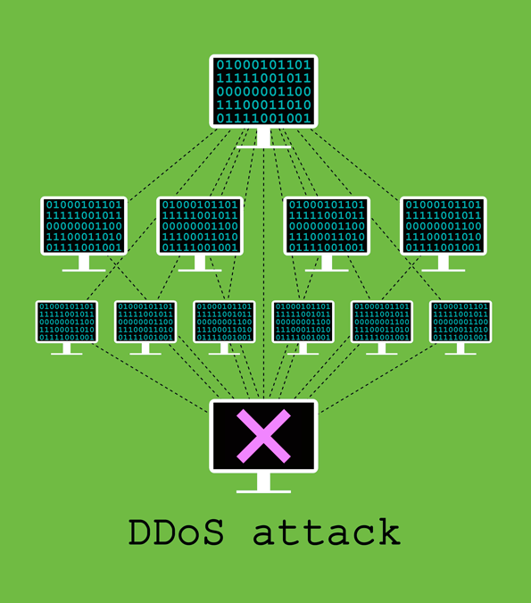

En el área de la ciberseguridad nos encontraremos con distintos tipos de ciberataques, uno de los más conocidos son los **ataques de denegación de servicios**, como su nombre lo indica están enfocados en **sobrecargar de consultas los servidores de un servicio**, como por ejemplo, una página web, evitando su funcionamiento.

Para comprender mejor la lógica de este tipo de ataque, imaginemos la siguiente situación: supón que tienes un restaurante con una **capacidad máxima de 50 personas para atender**, y todos los días tienes un flujo de gente que coincide con tu capacidad, lo cual es manejable tanto para ti como para tus empleados. Sin embargo, un día, una persona malintencionada decide enviar **1000 personas** a tu restaurante de manera simultánea. En esta situación, sería imposible atender a tantas personas, todo se convertiría en un caos y el servicio colapsaría. Por consiguiente, no te quedaría más remedio que cerrar el local.

Este escenario es similar a lo que sucede cuando un hacker envía un exceso de peticiones a un servidor, tantas que el servidor no es capaz de manejarlas. Esto ocasiona que el servidor colapse y corte la conexión con el resto de los usuarios.
Este escenario es similar a lo que sucede cuando un hacker envía un exceso de peticiones a un servidor, tantas que el servidor no es capaz de manejarlas. Esto ocasiona que el servidor colapse y corte la conexión con el resto de los usuarios.

A continuación se presentaran las 2 variantes de denegación de servicio conocidas:

## Denegación de servicio (DoS)

Un ataque DoS o denegación de servicio es cuando un hacker usa un solo sistema (como un computador) para denegar el servicio de otro (como un servidor), este ataque funciona inundando el sistema objetivo con paquetes de consultas volviéndolo inaccesible para el resto de usuarios, dado que le es imposible responder nuevas peticiones de otros dispositivos.
Esta variante ya no es tan común debido a que su modus operandi es lento y al ser un solo dispositivo el que envía las consultas, es riesgoso para que atacante debido a que fácilmente se puede rastrear el origen.

## Denegación de servicio distribuido (DDoS)

El ataque de denegación de servicio distribuido (DDoS), a diferencia del DoS convencional, implica el uso de **múltiples** sistemas para dirigirse contra un **único objetivo**. Esta técnica es considerablemente más peligrosa que el DoS estándar, ya que al enviar un flujo masivo de solicitudes a los servidores desde numerosas computadoras, resulta extremadamente complicado rastrear el origen exacto del ataque.

Los sistemas que conforman la red utilizada por el atacante se conocen como **"Zombies" o "BotNet"**, y son máquinas que han sido infectadas con malware. En la mayoría de los casos, los usuarios de estos sistemas **no tienen ni la más mínima sospecha** de que sus dispositivos han sido comprometidos. Esta falta de conocimiento por parte de los usuarios es parte de lo que hace que los DDoS sean una amenaza tan insidiosa y difícil de combatir.

El hecho de que los ataques provengan de múltiples orígenes de manera simultánea, aumenta exponencialmente su capacidad para abrumar y desestabilizar incluso los servidores mas robustos.

Un ejemplo de un ataque de denegación de servicio distribuido es el ataque a la empresa **PayPal** en 2010, por Christopher Weatherhead, un hacker conocido bajo el alias **"Nerdo".**
El hacker lanzo un ataque a la empresa utilizando una **botnet** enviando una cantidad masiva de trafico falso a los servidores de Paypal.
El ataque duro varios días a afecto **significativamente** a los servicios en línea, lo cual resulto en la interrupción de las transacciones y acceso a las cuentas de los usuarios.
Las perdidas monetarias de Paypal fueron significativas, se estima que **la empresa perdió alrededor de $5.5 millones de dólares en ingresos.**

## ¿Cómo podemos evitar una denegación de servicio en nuestro sistema?

1. Firewall robusto
Utiliza un firewall potente para filtrar y bloquear trafico no deseado. 
2. Servicios Anti-DDoS
Contrata servicios especializados Anti-DDoS que puedan detectar y mitigar ataques.
3. Limita la tasa de solicitudes
Implementa limites en la tasa de solicitudes de clientes legítimos. Esto ayuda a prevenir que un atacante sobrecargue tu sistema con una gran cantidad de solicitudes.
4. Monitoreo y detección temprana
Utiliza herramientas de monitoreo para detectar patrones de trafico anormal y comportamiento sospechoso.
5. Actualizaciones y parches regulares
Mantén tu software y sistemas actualizados con los últimos parches de seguridad. Esto ayuda a cerrar posibles vulnerabilidades que los atacantes podrían aprovechar.

