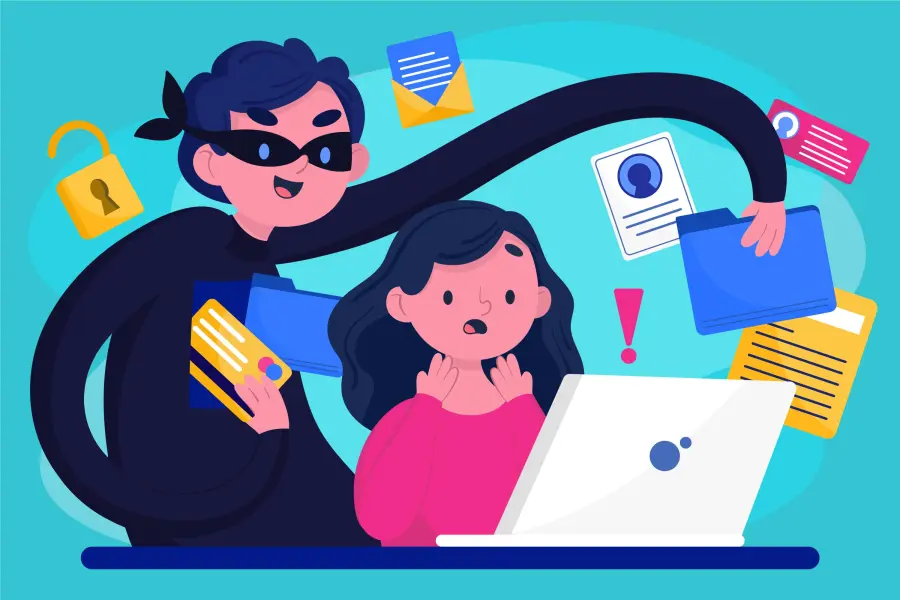

"Alerta, su contraseña del banco debe ser cambiada, ingrese al siguiente **[link]**"
"Su paquete ha sido enviado, se adjunta el recibo de envío, **[link]**"
"Su cuenta necesita ser validada, siga los pasos adjuntos, **[link]**"

## ¿Alguna vez has recibido un mensaje similar?

Cuidado, podrías estar frente a un ataque informático llamado **Phishing**

Los ataques de phishing son **correos electrónicos, mensajes de texto, llamadas telefónicas o sitios web fraudulentos** diseñados para manipular personas para que descarguen malware y/o compartan información personal como **credenciales de inicio de sesión, tarjetas de crédito, números de cuentas bancarias, etc.** Con el objetivo de **suplantar tú identidad.**

El phishing es el ataque más recurrente en la red debido a que su éxito se basa en el error humano.
El atacante al hacerse por una persona u organización en la que la victima confía (empresa donde trabaja, su banco, su jefe, etc) crea una sensación de urgencia que la lleva a actuar de manera precipitada.

## ¿Cómo evitamos los ataques de phishing?

1. **Utiliza doble factor de autenticación (2FA)**
Hazlo siempre que sea posible para añadir una capa adicional de seguridad.
2. **Filtros Anti-Spam**
Utiliza o configura el filtro anti spam de tu correo electrónico, esto puede ayudar a **detectar y bloquear** mensajes de phishing antes de que lleguen a tu bandeja principal.
3. **Prudencia**
**Nunca compartas información confidencial**, como contraseñas, números de tarjetas de crédito, información personal, a través de correos electrónicos o mensajes no seguros.
4. **Verificar la seguridad de los sitios web**
Antes de ingresar información a un sitio web, asegúrate que la **URL** comience con **"https://' (protocolo de transferencia segura de hipertexto)** en lugar de **'http://' (protocolo de transferencia de hipertexto)**

Es crucial mantenerse alerta ante mensajes sospechosos en la red, ya que podrían ser señales de un intento de phishing. Por lo tanto, es importante informar a la sociedad sobre los posibles medios de engaño junto con sus métodos de prevención.

De igual manera, hay que recordar que el cibercrimen evoluciona, es probable que en un futuro nos encontremos con una gran variedad de nuevas formas de estafa, debido a ello ser cauteloso e informado siempre será la mejor opción frente a cualquier ataque.

