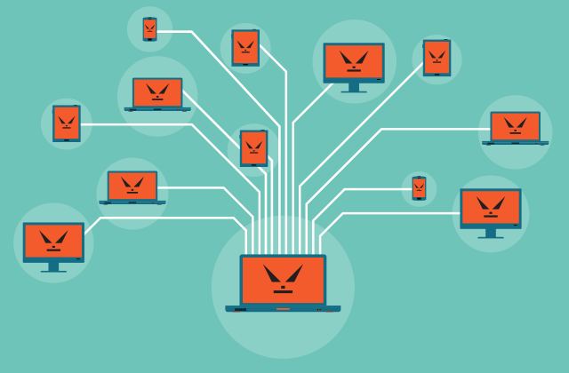
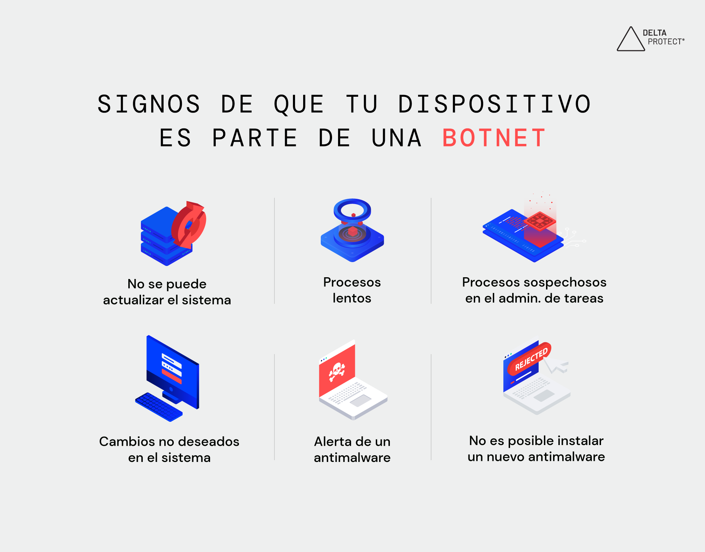

Actualmente el número de ciberataques que ocurren cada año ha ido en aumento con el paso del tiempo, según un estudio de Cybersecurity Ventures, en el 2023 hubieron aproximadamente **2200 casos de ataques informáticos al día, esto equivale a 1 ataque cada 39 segundos.**

Los ataques informáticos cada vez son mas difíciles de prevenir y contrarrestar, es una amenaza constante y a la vez puede estar mas cerca de lo que imaginamos, incluso en este momento es probable que tus dispositivos estén formando parte de un ataque sin que seas consciente de ello.

## ¿Qué es una botnet?

**Botnet o "Robot network"** es un conjunto de dispositivos tanto IoT (Internet of things) como dispositivos de computo (Computadores, servidores, etc.) que han sido infectados por malware que son controlados remotamente por un atacante y que pueden ser utilizados de manera conjunta para realizar actividades maliciosas.

## ¿Para que son utilizadas las botnets?

Pueden ser utilizadas para realizar distintos tipos de ciberataques, así como realizar otras tareas que no caen en la definición de un ataque informático, tales como:
1. **Spam y fishing masivo**
   - El envío masivo a spam a usuarios permite la misma propagación de la botnet mediante la distribución de malware de forma deliberada, e igualmente, mediante el phising se pueden llevar a cabo estafas a gran escala.
2. **Ataques DDoS**
   - Consiste en saturar de consultas un servidor o sitio web, haciendo que este colapse.
3. **Keyloggers**
   - Algunas botnets cuentan con malware capaz de monitorizar la actividad de las victimas, recopilando datos como contraseñas, información personal, cuentas bancarias, etc.
4. **Minería de criptomoneda**
   - Esto es algo nuevo en las botnets, consiste en el uso de los dispositivos infectados para minar monedas virtuales como el Bitcoin sin que los usuarios se den cuenta, esto hace que los ordenadores se vuelvan lentos y consuman mucha electricidad. 

## Algunos ejemplos de botnets conocidas:

1. **Zeus Botnet**
   - Zeus es un troyano bancario utilizado para robar información financiera sensible de usuarios de todo el mundo.
2. **Mirai Botnet**
   - Responsable de algunos de  los mayores ataques DDoS de la historia, ha llegado a infectar cámaras de seguridad y enrutadores para lanzar ataques masivos contra objetivos específicos.
3. **Sality Botnet**
   - Especializada en distribución de malware y robo de información. Se propaga principalmente en dispositivos Windows, evolucionando con el tiempo para evitar detecciones y persistir en sistemas comprometidos.
4. **Necurs Botnet**
   - Una de las botnets mas grandes y persistentes, ha sido utilizada para una gran variedad de propósitos como: spam, distribución de ransomware y ataques DDoS. Se estima que ha afectado millones de dispositivos en todo el mundo.

:::IMPORTANT
### Ante todo esto... ¿Cómo puedo proteger mis dispositivos de las botnets?
:::
1. **Crear contraseñas seguras**
   - El uso de contraseñas seguras o gestores de contraseña que ayuden a crearlas y protegerlas es una buena medida de seguridad para malwares capaces de descifrar contraseñas débiles. 
2. **Utilizar firewalls y antimalware**
   - Ayuda a evitar que algunos tipos de malware infecten los dispositivos. De igual manera, los softwares antimalware son capaces de detectar y eliminar software malicioso antes de que cause problemas en el dispositivo. 
3. **Mantener actualizados los sistemas**
   - Actualizar el software permite cubrir brechas de seguridad que en versiones obsoletas los ciberdelincuentes podían aprovechar para infectar dichos dispositivos.
4. **Evitar archivos y sitios web sospechosos**
   - Descargar archivos de correos desconocidos o recibidos de manera inesperada puede traer consigo malware, de igual forma si uno de estos correos contiene un enlace te puede llevar a sitios web de phishing o te hará descargar software malicioso sin que te des cuenta.